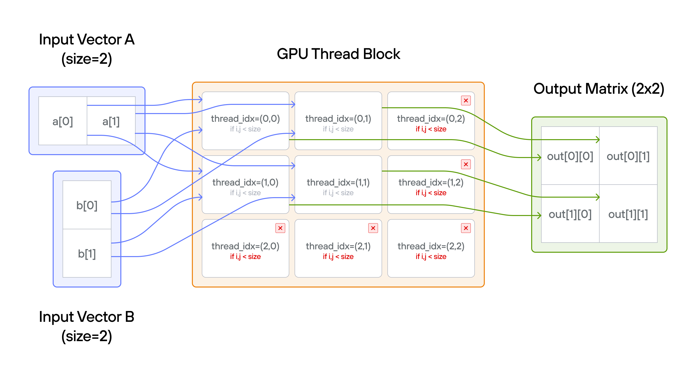
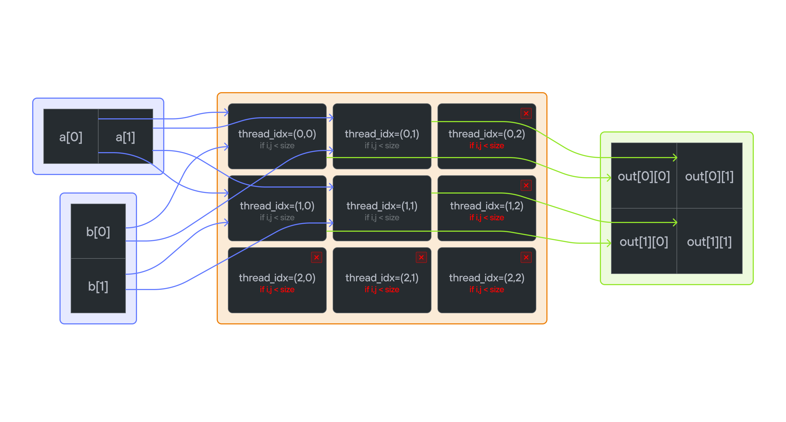

# Puzzle 5: Broadcast

## Overview

Implement a kernel that broadcast adds vector `a` and vector `b` and stores it in 2D matrix `output`.

**Broadcasting** in parallel programming refers to the operation where lower-dimensional arrays are automatically expanded to match the shape of higher-dimensional arrays during element-wise operations. Instead of physically replicating data in memory, values are logically repeated across the additional dimensions. For example, adding a 1D vector to each row (or column) of a 2D matrix applies the same vector elements repeatedly without creating multiple copies.

**Note:** _You have more threads than positions._

## Key concepts
- Broadcasting vectors to matrix
- 2D thread management
- Mixed dimension operations
- Memory layout patterns

## Implementation approaches

### [🔰 Raw memory approach](./raw.md)
Learn how to handle broadcasting with manual memory indexing.

### [📐 LayoutTensor Version](./layout_tensor.md)
Use LayoutTensor to handle mixed-dimension operations.

💡 **Note**: Notice how LayoutTensor simplifies broadcasting compared to manual indexing.
