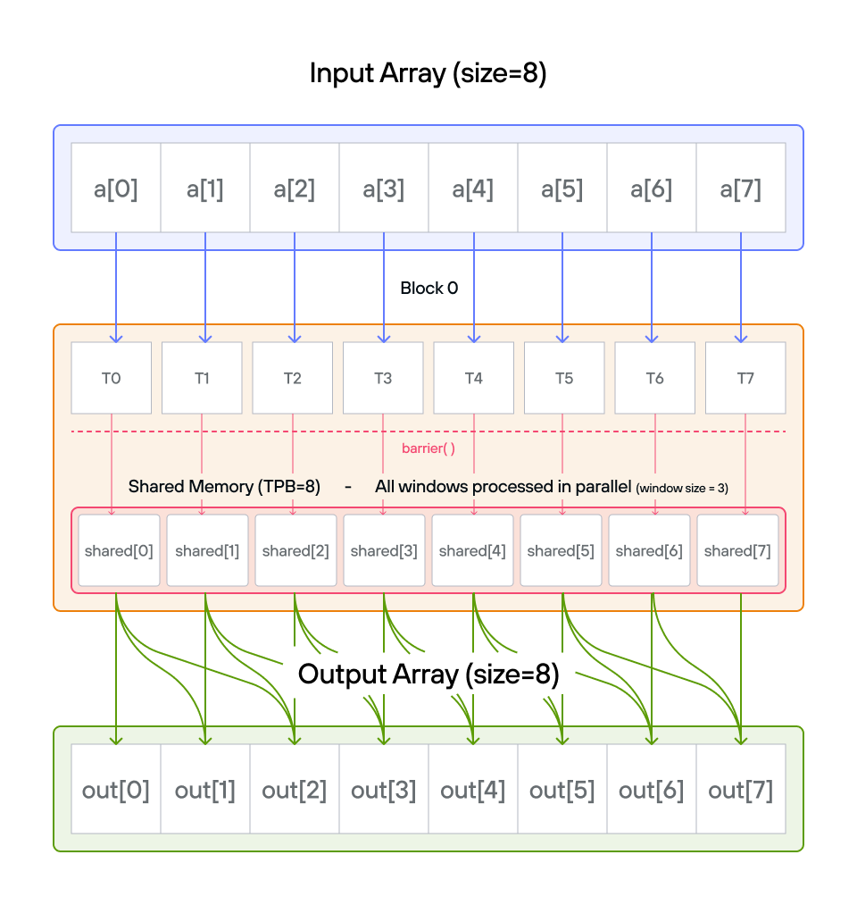
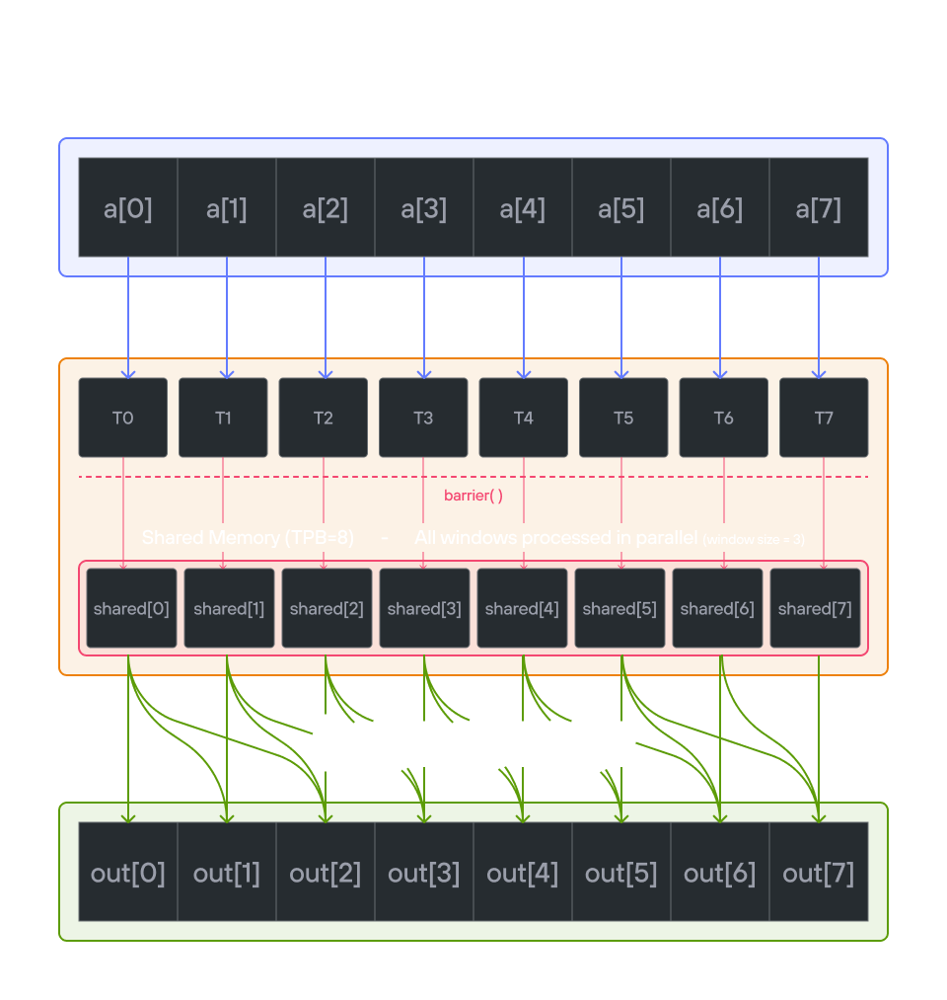

# Puzzle 11: Pooling

## Overview

Implement a kernel that computes the running sum of the last 3 positions of vector `a` and stores it in vector `output`.

**Note:** _You have 1 thread per position. You only need 1 global read and 1 global write per thread._

## Implementation approaches

### [🔰 Raw memory approach](./raw.md)
Learn how to implement sliding window operations with manual memory management and synchronization.

### [📐 LayoutTensor Version](./layout_tensor.md)
Use LayoutTensor's features for efficient window-based operations and shared memory management.

💡 **Note**: See how LayoutTensor simplifies sliding window operations while maintaining efficient memory access patterns.
